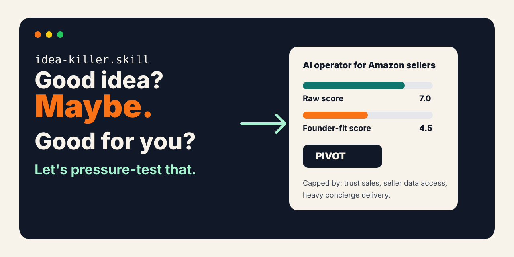
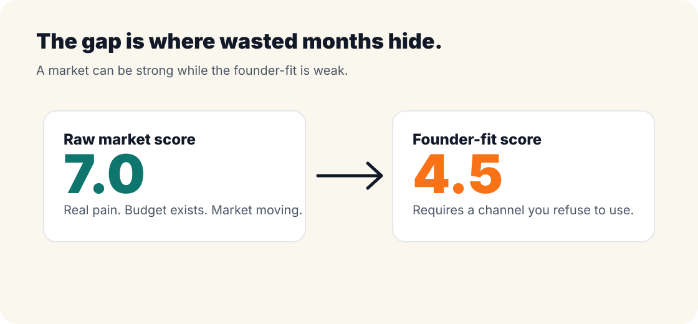
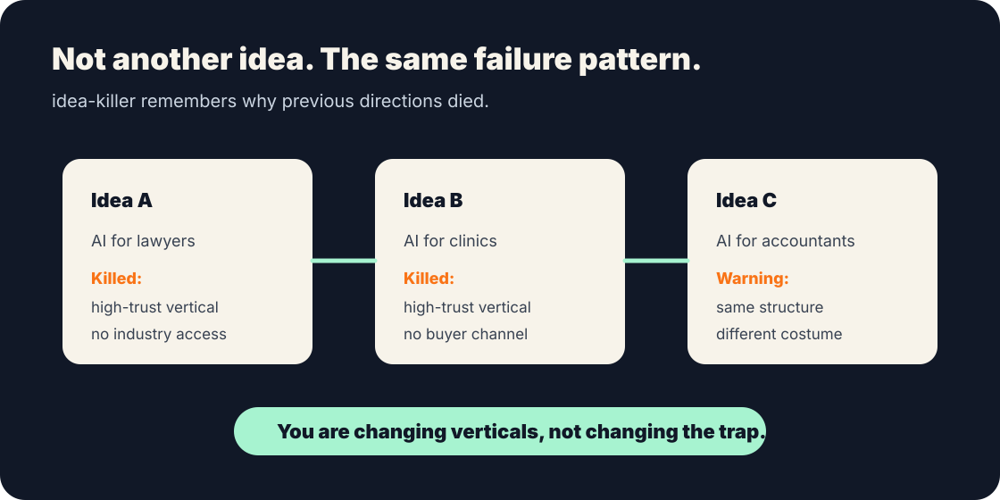
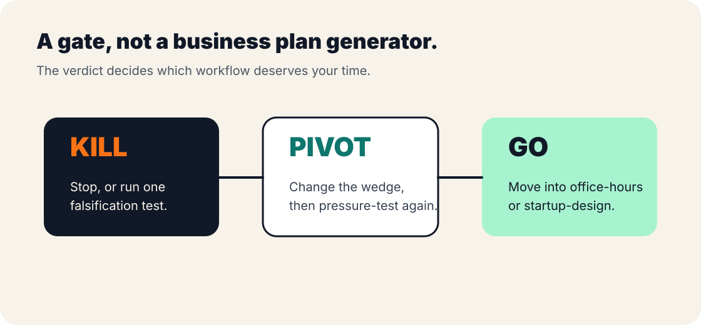

<div align="center">

# idea-killer.skill

<p>
  <a href="README.md"><strong>English</strong></a> · <a href="中文.md">中文</a>
</p>

<p>
  
</p>

> *A good idea does not mean a good fit for you.*

[](LICENSE)
[](https://skills.sh)
[](#local-files-and-privacy)

**A local Claude Code skill. It profiles you first, then tells you whether a startup idea is `Kill`, `Pivot`, or `Go` — *for you specifically*.**

Not an idea scorer. Not a business plan generator.

> Same idea = `Go` for one founder, `Pivot` for another, `Kill` for a third.  
> Not because the market changed. Because the founder did.

I used it to pressure-test myself for 30 days after leaving my job.  
**10 ideas in. 8 Kills. 2 Pivots. 0 Go.** Including the 8.5/10 one I was sure about.  
[👉 See the 10 real verdicts](#receipts-the-authors-own-10-verdicts)

<br>

[Demo](#demo) · [Install](#install) · [Why It Exists](#why-it-exists) · [10 Real Verdicts](#receipts-the-authors-own-10-verdicts) · [How It Works](#how-it-works)

</div>

---

## Demo

```text
You    ❯ Use idea-killer to pressure-test:
         AI operator for Amazon sellers (digital employee)

idea-killer ❯ First, three founder-profile questions:
              · Do you have access to seller communities or owners?
              · Are you willing to do BD and concierge support long-term?
              · How much runway can you commit?

You    ❯ None. Not willing. 6-8 months.

────────────────────────────────────

Verdict ❯ Pivot

Raw market score:    7.0 / 10   ← The market is real
Founder-fit score:   4.5 / 10   ← But your profile says otherwise

cap_reason:
Early validation depends on seller trust, real store data,
and concierge delivery. The three things you just told me —
no access, no BD, short runway — lock all three down.

Better wedge:
Don't sell an "AI employee". Build a weekly decision brief
the seller boss actually wants to read:
selection opportunities, ad anomalies, inventory risks,
competitor moves — only the 3 that change a decision.

Next step:
Find 5 Amazon seller owners. Get them to show you last week's
real ops report. If none will → it's not a product problem,
it's an access problem → Kill.
```

A normal idea validator says "do more research."  
idea-killer answers exactly one question:  
**Is this idea worth your next 2-week sprint?**

---

## Install

```bash
npx skills add mubaiblake/idea-killer
```

Then say to your agent (Claude Code / Codex / OpenClaw):

```text
Use idea-killer to pressure-test: [your startup idea]
```

Or, if you have no specific idea yet:

```text
I don't have a specific idea. Recommend 3 directions that fit my profile.
```

Manual install:

```bash
git clone https://github.com/mubaiblake/idea-killer.git ~/.claude/skills/idea-killer
```

---

## Why It Exists

Most idea validators ask:

- Is the market big?
- Is the pain real?
- Are there competitors?
- Can AI solve it?

idea-killer asks the more expensive question:

> **Can *you* actually execute this idea for the next 6 months?**

The same idea can be `Go` for one founder, `Pivot` for another, and `Kill` for a third — *because the founder is different*, not because the market changed.

<p align="center">
  
</p>

---

## Receipts: The Author's Own 10 Verdicts

I left my job at a top tech company and spent 30 days exploring directions. I used idea-killer to pressure-test every one. Here's what came back:

| # | Idea | Verdict | Score | Killed by |
|---|---|---|---|---|
| 10 | AI operator for cross-border sellers | `Kill` | 3.8 | No vertical know-how + no seller access |
| 09 | Cross-border product picker agent | `Kill` | 3.5 | Same + every top tool already AI-native |
| 08 | Sports SaaS (coach/club workflow) | `Pivot` | 6.3 | C-side dead, B-side promising but unproven |
| 07 | Fitness tracker + real-time AI video coach | `Kill` | 2.5 | Free competitor features didn't get users to pay |
| 06 | Proactive recommendation channel v2 | `Kill` | 3.3 | Reskinned v1 |
| 05 | AI proactive push channel | `Kill` | 3.0 | Users want less info, not more |
| 04 | GTM-stories content IP → product | `Kill` | 3.5 | Two dead-ends stacked |
| 03 | Open-source Memory SDK | `Pivot` | 5.0 | Right thesis, wrong shape |
| 02 | Pre-session memory control UI | `Kill` | 4.0 | Same shape as #01 |
| 01 | GPT chat history manager | `Kill` | 4.6 | General AI will absorb this in 6-12 months |

**[👉 See full 10 verdicts and structural clustering](examples/en/)**

The most useful insight wasn't any single Kill. It was that 10 different-looking ideas mapped to only **4 repeating failure structures**:

- ✗ Outsider building high-trust / high-know-how vertical tooling
- ✗ Soft-value subscriptions, low willingness to pay
- ✗ General AI will absorb this in 6-12 months
- ✗ Channel mismatched to founder profile

I thought I had 10 different directions. I had been reskinning the same 4 traps 10 times.

---

## ⭐ Meta-twist: the actual breakthrough came after Kill #9

If the skill only ever killed ideas, it would be the same as every other validator: you give one, it kills it, you give another.

**This skill stopped after the 9th Kill.**

The 10th was supposed to be "one-person-company AI stack / Claude Code dev tools — at least my engineering background fits there." But the moment I typed "honestly my engineering ability isn't strong relative to other developers," the skill did not produce a 10th idea.

It said:

> "Your third self-correction forces me to stop. The 9 previous Kills weren't because your ideas weren't good enough.
>
> They were because the 'asymmetric advantages' I was assuming for you were halo assumptions.
> Drop into the actual competitive layer of each direction — not the resume layer — and you're at zero in every one of them.
>
> This is profile mismatch. It is not an idea-supply problem."

Then it surfaced the table the founder couldn't see:

| What I'd been recommending | The actual competitive layer | Founder's position there |
|---|---|---|
| Cross-border AI agency | Cross-border veterans + insider co-founder | No experience → 0 |
| Fitness AI coach | CV / pose-estimation experts + fitness coaches | Not in field → 0 |
| One-person AI dev tools | Simon Willison / theo.gg / early MCP contributors | Just admitted not strong → 0 |
| ... | | |

Instead of an idea #10, it gave three meta-options — none of them "another idea":

1. **Find a co-founder. Stop going solo.** Your profile + a "domain know-how + insider network + outbound GTM" co-founder unlocks the high-score directions.
2. **Lower expectations: side project, not venture.** Solo profile → 30-40% probability of $1-3k/mo indie SaaS, < 10% for venture-scale. Recalibrate.
3. **Embed for 6 months.** Join an early team, accumulate know-how + relationships. Patch the profile. Then start.

I picked the path almost no validator would push: **don't choose a startup direction yet.** Build a public track record for 12-18 months — ship in public, write on X, accumulate IP. Let the direction emerge from what gets traction.

That moment was the actual product. **Not 10 Kill verdicts. The moment the system says "stop optimizing the wrong variable."**

> idea-killer ships with `diagnostic-mode`: triggered automatically after 3+ consecutive Kills. It re-runs the meta-check on the current `PROFILE.md` and surfaces the halo gap before another sprint is wasted.

**[👉 Read the full case study](examples/en/case-study-halo-trap.md)**

---

## Why Not Just Another Idea Validator

### 1. It reads YOU before it reads the idea

Before scoring anything, idea-killer asks the founder-profile questions that **specifically matter for this idea** (not a fixed intake form):

- Hard constraints: runway, capital, things you refuse to do
- Real channels: who you can reach, what you'll actually keep posting on
- Executable actions: cold sales? on-camera demos? long-term support?
- Past failure structure: what stopped you last time?

These aren't background context. They're hard caps that change the verdict.

### 2. Two scores, always separated

- `score_pressure_raw` — how strong the idea is in the market
- `score_pressure_final` — how strong it is for *you*
- `cap_reason` — names exactly which constraint of *yours* caused the gap

The gap is where wasted sprints hide.

### 3. It catches you reskinning the same trap

<p align="center">
  
</p>

idea-killer keeps a local `signatures.jsonl` of past kill structures and flags when a new idea is the same skeleton in different clothes.

### 4. It's a gate, not a plan generator

<p align="center">
  
</p>

- `Kill` → stop, or run one falsifying experiment
- `Pivot` → reshape, rerun
- `Go` → THEN go to `office-hours` / `startup-design`

---

## How It Works

| Step | Action | Why |
|---|---|---|
| 1. Phase 0 align | Read existing PROFILE.md / INDEX.md / signatures.jsonl | Don't re-ask facts already captured |
| 2. Dynamic profile | Ask only verdict-changing questions for *this* idea | Founder-fit is not a fixed form |
| 3. Structural dedup | Compare against past failure signatures | Block re-skinned traps |
| 4. Dual scoring | Raw market score vs founder-fit score | Surface the real mismatch |
| 5. Route | Kill / Pivot / Go + next action | Output must be actionable |

```text
market strength
- founder constraints
- channel mismatch
- execution avoidance
- repeated failure pattern
= real score for you
```

---

## Local Files And Privacy

idea-killer writes everything in the current working directory:

```text
PROFILE.md            # founder portrait
INDEX.md              # ideas you've run
signatures.jsonl      # failure-structure fingerprints
ideas/                # full reports
direction-research/   # direction recommendations (if you ran them)
```

Your founder profile and decision history stay on your machine. No backend, no telemetry.

---

## Repo Structure

```text
idea-killer/
├── SKILL.md
├── README.md               # English (you are viewing)
├── 中文.md                  # 中文
├── LICENSE
├── assets/                 # SVG visuals
│   ├── *.svg               # English README visuals
│   └── *.zh.svg            # Chinese README visuals
└── examples/
    ├── sample-{kill,pivot,go}-report.md   # verdict templates
    └── 01..10-*.md                         # author's own 10 receipts
```

---

## Who It's For

- Indie hackers tired of building things no one buys
- AI builders with too many directions and no filter
- Pre-founders worried they're just getting hyped
- Serial direction-switchers wanting to spot their own pattern
- Markdown-first workflow users who want auditable decisions

Not for you if:

- You want a full business plan
- You want encouragement at every step
- You can't accept a `Kill` verdict
- You want to give your founder context to a black-box SaaS

---

## License

MIT

---

<div align="center">

**idea-killer doesn't start your company.**  
**It just asks the most expensive question before you waste another sprint.**

</div>
