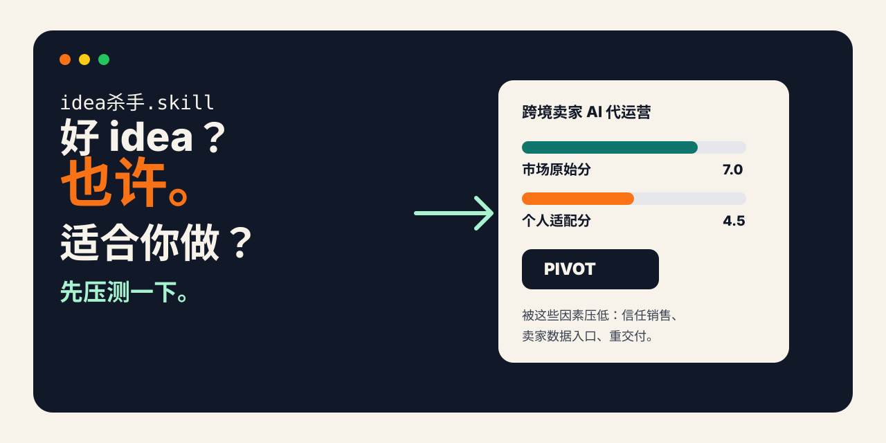
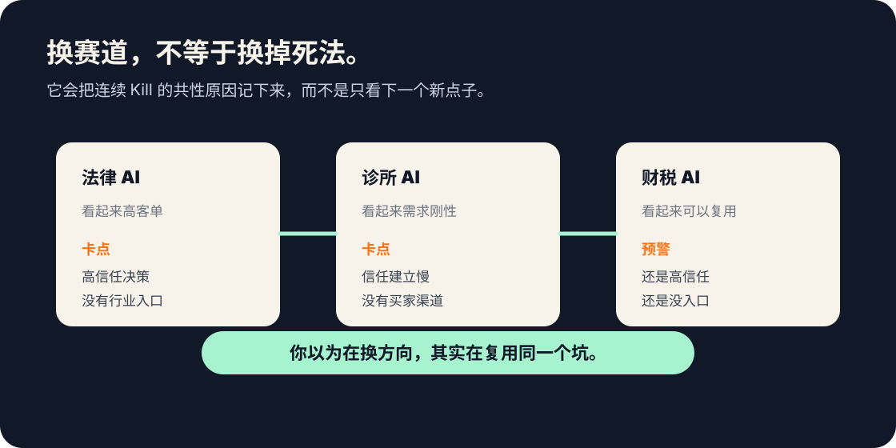
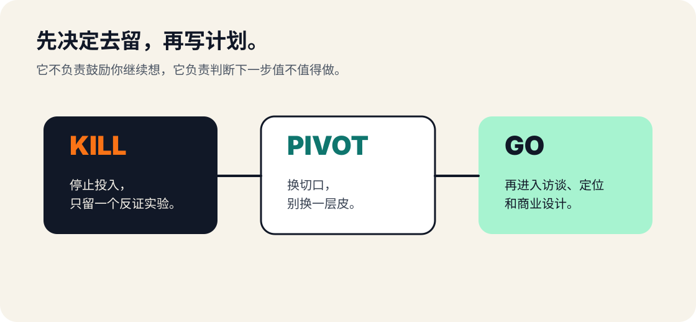

<div align="center">

# idea杀手.skill

<p>
  <a href="README.md">English</a> · <a href="README_zh-CN.md"><strong>中文</strong></a>
</p>

<p>
  
</p>

> *「Good Idea ≠ 适合你做。」*

[](LICENSE)
[](https://skills.sh)
[](#本地文件与隐私)
[](#为什么不是普通-idea-validator)

**一个本地 Agent skill。它先用对话把你的画像问清楚，再判断一个创业 idea 到底适不适合你做。**

它不是 idea 评分器，也不是商业计划生成器。  
它只输出三种结论：`Kill`、`Pivot`、`Go`。

> 同一个 idea，对有行业入口的人是 `Go`，对没销售意愿的人可能就是 `Kill`。  
> 不是市场变了，是 founder 变了。

我自己用它压测了 30 天 —— **10 个 idea，8 Kill，2 Pivot，0 Go**。包括我最看好的那个 8.5 分方向。  
[👉 看 10 份真实判决](#真实档案作者自己的-10-连判决)

<br>

[效果示例](#效果示例) · [安装](#安装) · [它判断什么](#它判断什么) · [10 份真实档案](#真实档案作者自己的-10-连判决) · [工作原理](#工作原理) · [本地文件](#本地文件与隐私)

</div>

---

## 效果示例

```text
用户  ❯ 用 idea-killer 压测：给跨境电商卖家做 AI 代运营数字员工

idea-killer ❯ 先确认你的画像：
              · 你有跨境圈人脉或卖家入口吗？
              · 你愿意做线下 BD 和长期客服吗？
              · 你的可投入跑道是几个月？

用户  ❯ 都没有；不愿做 BD；6-8 月。

────────────────────────────────────

结论 ❯ Pivot

市场原始分:        7.0 / 10   ← 这个方向本身有需求
适合你做的分:      4.5 / 10   ← 但你的画像是另一回事

cap_reason:
早期验证最依赖卖家信任、真实店铺数据、重交付。
你刚说的三件事——没入口、不愿 BD、跑道短——
恰好把这三个验证动作全部锁死了。

更适合的版本:
不要卖"AI 员工"。先做一个老板每周愿意看的决策报告：
选品机会 / 广告异常 / 库存风险 / 竞品动作，
只保留能让老板立刻改决策的 3 件事。

下一步:
找 5 个 Amazon 卖家老板，让他们给你看上周真实运营报表。
没人愿意给你看 → 不是产品问题，是入口问题 → 直接 Kill。
```

普通 idea validator 会说"再调研一下"。  
idea-killer 只回答一个问题：**下一次 2 周冲刺，值不值得投到这个方向上**。

---

## 安装

```bash
npx skills add mubaiblake/idea-killer
```

然后在 Claude Code / Codex / OpenClaw 等支持 skill 的 Agent 里直接说：

```text
用 idea-killer 帮我压测：我想做一个面向独立开发者的 landing page 诊断 agent
```

也可以在还没有具体 idea 时说：

```text
我还没有具体 idea，根据我的画像推荐 3 个更适合我做的创业方向
```

手动安装：

```bash
git clone https://github.com/mubaiblake/idea-killer.git ~/.claude/skills/idea-killer
```

---

## 它判断什么

idea-killer 做的不是 idea validation，是 **founder-idea fit gate**。

<p align="center">
  
</p>

普通 idea validator 问：

| 普通问题 | idea-killer 继续追问 |
|---|---|
| 市场大不大？ | 这个市场你进得去吗？ |
| 痛点强不强？ | 你能拿到真实用户和真实数据吗？ |
| AI 能不能做？ | 早期交付动作你愿意连续做 6 个月吗？ |
| 竞品多不多？ | 你有什么非共识 wedge？ |
| 方向看起来好不好？ | 对你是 `Go`，还是只是换皮重复旧坑？ |

**同一个方向，对不同 founder 会得到不同 verdict：**

| Founder 状态 | Verdict |
|---|---|
| 有行业入口 + 愿做销售 + 6 个月 runway | `Go` |
| 市场有需求，但当前切法不匹配渠道 | `Pivot` |
| 没有入口，还依赖明确不愿做的动作 | `Kill` |

---

## 真实档案：作者自己的 10 连判决

我从字节离职后用这个 skill 压测自己想了 30 天的方向。结果如下：

| # | Idea | Verdict | 压测分 | 致命点 |
|---|---|---|---|---|
| 10 | 跨境电商 AI 代运营数字员工 | `Kill` | 3.8 | 没跨境 know-how + 没卖家入口 |
| 09 | 跨境电商选品 Agent | `Kill` | 3.5 | 同上 + 头部全部已 AI 化 |
| 08 | 运动 SaaS（教练/俱乐部工作流） | `Pivot` | 6.3 | C 端死路 → B 端有戏但需验证 |
| 07 | 健身 + AI 视频实时教练 | `Kill` | 2.5 | Keep 卡卡免费同款都没人付费 |
| 06 | 主动式推荐推送号 v2 | `Kill` | 3.3 | 与 v1 同构换皮 |
| 05 | AI 主动推送号 | `Kill` | 3.0 | 用户要减法不要加法 |
| 04 | GTM 案例内容 IP → 推产品 | `Kill` | 3.5 | 双重死路叠加 |
| 03 | 开源 Memory SDK | `Pivot` | 5.0 | 主线对齐但形态错 |
| 02 | Pre-session Memory 管控 | `Kill` | 4.0 | 与 #01 结构同构 |
| 01 | GPT 聊天历史管理工具 | `Kill` | 4.6 | 通用 AI 即将原生覆盖 |

**[👉 看完整 10 份判决与归类](examples/zh/)**

最戳我的不是 Kill，是它指出来的同一种结构在反复换皮：

- ✗ 外行做高信任/高 know-how 垂直
- ✗ 软价值订阅 + C 端不付费
- ✗ 通用 AI 6-12 月内会原生覆盖
- ✗ 渠道与 founder 画像不匹配

我以为我有 10 个不同方向，其实我只是在同 4 种死法上换皮 10 次。

---

## ⭐ Meta-twist：第 10 个 Kill 后才出现的真正价值

如果 skill 只会 Kill idea，它就跟其他 validator 一样：你给一个，它毙一个，你再换一个。

**这个 skill 在第 9 个 Kill 之后停下来了。**

第 10 个本该是「一人公司 AI 栈 / Claude Code 开发者工具」——但当我打字说「我的技术能力其实在开发者群体里也不强」的瞬间，skill 没有再推第 10 个 idea。

它说：

> "你这第三次自我校准让我必须停下来。前面 9 个 idea 全 Kill 不是因为 idea 想得不够多。
>
> 是因为我之前对你画像的'非对称优势'本身是光环假设——
> 落到真竞争层（不是简历层），你在每条赛道都是 0。
>
> 这是画像错配的直接产物，不是 idea 供给问题。"

它把作者自己当下看不见的那张表摆出来：

| 我之前推荐的方向 | 真实竞争层 | 你在这层的位置 |
|---|---|---|
| 跨境代运营 | 跨境老兵 + 圈内 co-founder | 没经验 → 0 |
| 健身 AI 教练 | CV/Pose Estimation 专家 + 健身教练 | 不在专业 → 0 |
| 一人公司开发者工具 | Simon Willison / theo.gg / MCP 早期 contributor | 你刚承认不强 → 0 |
| ... | | |

然后它给了三条**根本性选项 ——不是再选一个 idea**：

1. **找联合创始人，不再单飞** —— 你的画像配一个领域 know-how + 圈内人脉 + 外向 GTM 的合伙人就解锁高分方向
2. **降级预期：副业不做 venture** —— ¥5-20k/月 indie 副业概率 30-40%，venture-scale < 10%
3. **蓄力 6 月：进圈不创业** —— 加入一家垂类创业公司当早期员工/顾问，拿到 know-how + 人脉再 0-1

我后来选了一条几乎没有任何 validator 会推的路：**暂时不选 idea**，用 12-18 个月公开 ship + X 文字异步 + 累积 track record，让方向从反馈里自己浮现。

这才是 skill 真正的产品 —— **不是 10 份 Kill 报告，是让系统在你浪费下一个 sprint 之前，告诉你"你在优化错了的变量"**。

> idea-killer 内置 `diagnostic-mode`：连续 3+ Kill 自动触发，对当前 PROFILE.md 跑一次元复盘。

**[👉 看完整元案例对话](examples/zh/case-study-halo-trap.md)**

---

## 为什么不是普通 idea validator

### 1. 它先读你，再读 idea

idea-killer 在评估前会做一段对话，搞清楚以下变量（**不是问卷，是按 idea 的实际执行路径反推该问什么**）：

- 你的硬约束：runway、可投入预算、不愿做的事
- 你的真实渠道：你能直接触达哪些用户、哪些渠道你**愿意持续输出**
- 你的可执行动作：冷销售？视频出镜？线下 BD？长期客服？
- 你的历史失败结构：以前是被什么 reason 卡住的

这些**不是背景信息**，是直接改变 verdict 的硬门槛。

### 2. 市场分和适配分始终分开

一个 idea 可以市场很好，但不适合你。idea-killer 同时输出：

- `score_pressure_raw`：这个 idea 在市场上本身有多强
- `score_pressure_final`：这个 idea 对你这个人有多适合
- `cap_reason`：到底是什么个人约束压低了分数

**真正有价值的是中间的差距**——浪费下一个 sprint 的钱通常就藏在那里。

### 3. 会识别你反复踩的同一个坑

<p align="center">
  
</p>

如果你总是把同一种失败结构换个皮，它会用本地历史报告对照出来：

- 外行做高信任垂直工具
- 软价值、低付费意愿
- 依赖你不愿意使用的获客渠道
- 需要长期内容输出，但你实际不喜欢公开表达
- 销售周期比你的探索时间更长

这通常比"再给我 10 个新 idea"更值钱。

### 4. 它是 gate，不是商业计划生成器

<p align="center">
  
</p>

- `Kill`：停止，或只做一个能推翻结论的验证动作
- `Pivot`：改形，再重新压测
- `Go`：再进入 `office-hours` / `startup-design` 做问题定义、定位、商业计划

---

## 工作原理

输入一个 idea 后，idea-killer 做五件事：

| 步骤 | 做什么 | 为什么重要 |
|---|---|---|
| 1. Phase 0 画像对齐 | 读已有 PROFILE.md / INDEX.md / 失败结构记录 | 不重新问已经知道的事，避免漂浮假设 |
| 2. 动态画像追问 | 只问会改变 verdict 的问题（按 idea 反推） | founder-fit 不是泛泛背景 |
| 3. 历史结构去重 | 比对 signatures.jsonl 里的失败结构 | 防止换皮重做旧失败 |
| 4. 双分打分 | 市场原始分 vs 个人适配分 | 找出真正的 mismatch |
| 5. 给路线 | Kill / Pivot / Go + 下一步动作 | 输出必须能执行 |

核心公式很简单：

```text
market strength
- founder constraints
- channel mismatch
- execution avoidance
- repeated failure pattern
= real score for you
```

---

## 仓库结构

```text
idea-killer/
├── SKILL.md                # skill 本体
├── README.md               # English
├── README_zh-CN.md         # 中文（你正在看）
├── LICENSE
├── assets/                 # 视觉资产
│   ├── hero.svg
│   ├── hero.zh.svg
│   ├── raw-vs-fit.svg
│   ├── raw-vs-fit.zh.svg
│   ├── kill-pattern-memory.svg
│   ├── kill-pattern-memory.zh.svg
│   ├── routing-map.svg
│   ├── routing-map.zh.svg
│   └── social-card-xhs.svg
└── examples/
    ├── README.md           # 案例索引 + 失败结构归类
    ├── sample-{kill,pivot,go}-report.md   # 三种 verdict 模板
    └── 01..10-*.md         # 作者自己被压测的 10 份真档案
```

---

## 本地文件与隐私

idea-killer 默认把所有判断写在你当前工作目录：

```text
PROFILE.md            # 你的 founder 画像
INDEX.md              # 跑过的 idea 索引
signatures.jsonl      # 失败结构指纹
ideas/                # 每个 idea 的完整压测报告
direction-research/   # 候选方向调研（如果跑过）
```

这些文件留在本地。它们是你的创业判断日志，不是上传到某个黑盒 SaaS 的数据。

---

## 适合谁

- 独立开发者：想避免做没人买的工具
- AI builder：手上方向很多，但不知道该压哪一个
- 准创业者：担心自己只是被概念兴奋绑架
- 反复换方向的人：想识别自己的失败结构
- 本地 Markdown 工作流用户：想留下可审计判断记录

不适合：

- 想要完整商业计划
- 想被鼓励继续探索每个 idea
- 不愿意面对 `Kill` 结论
- 想把 founder context 完全交给黑盒 SaaS

---

## License

MIT

---

<div align="center">

**idea-killer 不替你创业。**  
**它只负责在你浪费下一个 sprint 前，问最贵的那个问题。**

</div>
